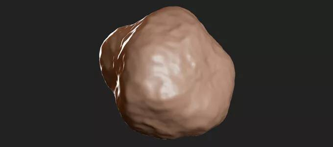

**This article is a Chinese translation version of [Creating a Spherical Reflection/Environment Mapping shader](https://www.clicktorelease.com/blog/creating-spherical-environment-mapping-shader/) by  [Jaume Sanchez](https://github.com/spite).**

It's really an excellent tutorial to implement the matCap effect on  WebGL via ThreeJS. You can easily understand and follow the tutorial, even for an amateur developer.

Thanks a lot~ 


**如果翻译中有谬误之处，请不吝指正~**


------

#### Terms | 术语

- [SEM](http://wiki.polycount.com/wiki/Spherical_environment_map): Spherical reflection/environment mapping，可译为**球面反射/环境贴图**。
- [LitSphere](http://wiki.polycount.com/w/index.php?title=Lit_Sphere&redirect=no): Lit sphere，或Lit spheres，直译为**被照亮的球体** 。
- [MatCap](http://wiki.unity3d.com/index.php/MatCap): Matcaps，或Material capture，译为**材质捕获**。
- [Suzanne](https://en.wikipedia.org/wiki/Blender_(software)#Suzanne): a monkey header 3D model，是一个猴子头部的三维模型。
- [Texel](https://en.wikipedia.org/wiki/Texel_(graphics)): **Tex**ture **el**ement或**Tex**ture pix**el**的合成字，译为**纹理元素**，简称**纹素**。
- [Torus  Knot](https://en.wikipedia.org/wiki/Torus_knot): 环面纽结，一种特殊的结。
- Shader：着色器
- Material:  材质、材质球
- Texture：纹理
- Map：贴图


------

------


# Creating a Spherical Reflection/Environment Mapping shader | 创建一个SEM着色器

文章写于2014年4月16日

阅读时间：5分钟

主题： WebGL， GLSL， three.js， shaders

* [**查看DEMO**](https://www.clicktorelease.com/code/spherical-environment-mapping/)
* [**GitHub代码链接**](https://github.com/spite/spherical-environment-mapping)


灯光是电脑生成图像最重要的部分之一。为了得到最终真实可信的展示效果，需要进行大量计算、设置以及微调工作。

球面反射/环境贴图技术（SEM）是一种模拟（译注：此处表达的是伪造、仿造的意思，表示这种技术并没有真正的使用着色器中的光照算法来实现，只是用一张静态的位图来模拟反射光。如果你还是理解不了，那么就理解为这就是一张最基础的颜色贴图，然后在颜色贴图上画上了反射光或反射环境。）光照算法中高光反射的快捷方法，在特定的使用场景中，甚至可以模拟完整光照实现效果。这种技术已经在三维软件中广泛应用，如： [Pixologic ZBrush](http://pixologic.com/zbrush/downloadcenter/library/) 和 [Luxology Modo](http://docs.luxology.com/modo/701/help/pages/shaderendering/ShaderItems/MatCap.html)。

------


## LitSphere/MatCap texture maps | 材质捕获的纹理贴图

SEM会使用特制的纹理贴图，这种贴图被叫做“lit spheres”或“matcaps”。它们就是基本的球面反射贴图，但是显示效果上有更多漫反射颜色，而不是像下图中最左侧的金属反光球一样将场景清晰的反射出来。

这种球面贴图包含了在相机前方展示的所有元素，也就说此贴图包含了入射光线照射到的、面朝相机的球体表面（译注：模型背朝相机部分的反射因为相机没有拍摄到，所以贴图中也没有办法表达）。这也是它不能作为完美环境贴图（译注：原文为perfect environment map，应该指的是[Cube map](https://en.wikipedia.org/wiki/Cube_mapping)、[Equirectangular](https://en.wikipedia.org/wiki/Equirectangular_projection)这种捕获到360°的环境贴图方式）的原因：因为缺失了背朝相机部分的图像信息，所以这种反射不能跟随相机视角旋转而旋转。

那么，我们所能模拟的就是相机和灯光固定不动、模型自身转动的显示效果（译注：类似淘宝商家拍摄商品展示照片，相机是放在三脚架上固定的，灯光也是固定的（或使用摄影专用灯箱），将产品放在一个转盘上，每拍一张照片底部的转盘就旋转一定角度。[见图示](/images/creating-a-sem-shader/rotate-example.gif)）。


------


## Setting up the shader | 设置着色器

SEM的基本思路是使用从片元上法向量获取的UV坐标（此坐标用来查找matCap纹理）替代模型对象的原始纹理坐标。即可以在顶点着色器中完成（GPU会处理插值），也可以在片元着色器中完成。我们会先实现逐顶点的版本。

为了全面的理解SEM，我们假定一个完全正对相机镜头的平面（即平面的法向量与相机的向量平行）被映射到正正好好位于matCap纹理中心的纹素上；随着法向量从相机向量偏移（即两个向量打破平行状态，夹角从0°趋向于90°），被映射到的纹素就会越靠近边缘。指向上方的法线（我们说的是屏幕空间，所以这里的“上方”指的是物理屏幕的顶部）被映射到matCap纹理的顶部，指向下方的法线被映射到matCap纹理的底部。法线指向左和右也是同理。

所以，第一步我们需要设置两个向量，e(Eye)和n(Normal)。Eye是从相机（空间中在原点上的一个点。此处原文为“a point in space at the origin”，不确定是否翻译准确）射到片元位置的向量。Normal是在空间屏幕中的法线。我们需要将三维位置转换成四维向量，使它能够和矩阵相乘。

一旦我们有了这两个向量，我们就能计算反射向量了。

> 这个教程是基于**GLSL**语言编写着色器的。如果你使用了其他着色语言，并且该语言没有`reflect()`函数，你可以使用相对应的表达式替代：`r = e - 2. * dot( n, e ) * n;`


*译注：上图为文章作者插入的一个公式的图片，没有理解此公式的意思，并且整片文章中貌似也没有用到这个公式。*

我们获取向量，然后应用到公式中得到UV元组。

这是顶点着色器的代码：

```javascript
//SEM shader, per-vertex
//GLSL - Vertex shader source

varying vec2 vN;

void main() {

  vec4 p = vec4( position, 1. );

  vec3 e = normalize( vec3( modelViewMatrix * p ) );
  vec3 n = normalize( normalMatrix * normal );

  vec3 r = reflect( e, n );
  float m = 2. * sqrt(
    pow( r.x, 2. ) +
    pow( r.y, 2. ) +
    pow( r.z + 1., 2. )
  );
  vN = r.xy / m + .5;

  gl_Position = projectionMatrix * modelViewMatrix * p;

}
```

片元着色器获取了UV元组经过GPU插值后的值，然后使用它查找matCap纹理上对应的颜色值。这是代码：

```javascript
//SEM shader, per-vertex
//GLSL - Fragment shader source

uniform sampler2D tMatCap;

varying vec2 vN;

void main() {

  vec3 base = texture2D( tMatCap, vN ).rgb;
  gl_FragColor = vec4( base, 1. );

}
```

在JavaScript代码，使用了thrss.js创建着色器材质。实例化了一个新的`THREE.ShaderMaterial`，引用了上文定义的顶点着色器和片元着色器脚本，在一个材质`uniform`对象中使用了matCap贴图。以防万一，将水平和垂直的纹理包裹模式设置为`THREE.ClampToEdgeWrapping`，纹理边缘不会被卷曲（译注：猜测这边作者的意思是纹理不会被重复铺贴或者镜像铺贴，其实根据three.js开发文档中的描述，`.wrapS`和`.wrapT`的默认值就是`THREE.ClampToEdgeWrapping`）。这是代码：

```javascript
//Creating THREE.js material
//JavaScript - index.html

var material = new THREE.ShaderMaterial( {

  uniforms: {
    tMatCap: {
      type: 't',
      value: THREE.ImageUtils.loadTexture( 'matcap.jpg' )
    },
  },
  vertexShader: document.getElementById( 'sem-vs' ).textContent,
  fragmentShader: document.getElementById( 'sem-fs' ).textContent,
  shading: THREE.SmoothShading

} );

material.uniforms.tMatCap.value.wrapS =
material.uniforms.tMatCap.value.wrapT =
THREE.ClampToEdgeWrapping;
```

材质准备完毕，已经可以指定给模型对象了。


------


## Assigning the material to an object | 将材质指定到几何体对象

使用SEM材质很适合表达多边形上的不同类型高光，比如：褶皱、凹凸、甚至缓慢的波动。但在立方体上的表现效果不理想。在球体上效果是完全没有变化的，SEM在一个球体上的效果和matCap纹理的平面投影的效果完全相同（译注：也就说球体上的效果就是matCap纹理贴图的效果，不论你旋转摄像机镜头到任何角度，都是这个显示效果，不会有任何变化）。使用环面纽结几何体作为这个着色器测试模型是一个非常好的选择。


> 你可能同样对[Creating a disorted sphere with Perlin Noise](https://www.clicktorelease.com/blog/vertex-displacement-noise-3d-webgl-glsl-three-js)感兴趣。
>


------


## Phong (per-fragment) shading | Phong（逐片元）着色
我并不认为逐片元着色是真正必要的，但可能也取决于被渲染的模型，特别是被渲染的模型是低多边形面片的（译注：模型顶点数很少，精度很低）。在这种情况下，你可能需要逐片元的去计算，而不是依靠GPU插值。下面是使用逐片元着色修改后顶点着色器：

```
// SEM shader, per-fragment
// GLSL - vertex shader source

varying vec3 e;
varying vec3 n;

void main() {

  e = normalize( vec3( modelViewMatrix * vec4( position, 1.0 ) ) );
  n = normalize( normalMatrix * normal );

  gl_Position = projectionMatrix * modelViewMatrix * vec4( position, 1. );

}
```

注意我们没有计算`vN`元组，并使用`varying`传递到片元着色器中，而是使用`e`(Eye)和`n`(Normal)值替代，并传递到片元着色器中。下面是片元着色器的代码：

```
//SEM shader, per-fragment
//GLSL - fragment shader source

uniform sampler2D tMatCap;

varying vec3 e;
varying vec3 n;

void main() {

  vec3 r = reflect( e, n );
  float m = 2. * sqrt( pow( r.x, 2. ) + pow( r.y, 2. ) + pow( r.z + 1., 2. ) );
  vec2 vN = r.xy / m + .5;

  vec3 base = texture2D( tMatCap, vN ).rgb;

  gl_FragColor = vec4( base, 1. );

}
```

所以，之前在顶点着色器中被计算的`reflection`和`vN`值，在被插值后传递到片元着色器中。而在现在，每个片元都会计算`reflection`和`vN`值。

------


## DEMO | 示例


> [Spherical Environment Mapping shader in action](https://www.clicktorelease.com/code/spherical-environment-mapping)

这个示例展示三种不同的材质（**Matte red**，**Shiny black** 和 **Skin**），被用于三个不同的模型（**Torus  Knot**， **Bolb** 和 **Suzanne**）。他们的材质着色器是完全相同的，唯一的不同是matCap纹理贴图。这展现这种技术惊人的强大能力，它使模型对象的效果完全不同。

勾选“Enable Phong(per-pixel) shading”复选框后，可以观察逐顶点和逐片元之前的差异。最值得关注的差异在模型对象的边缘处。

**Torus Knot**是three.js的自带的几何体对象`THREE.TorusKnotGeometry`。**Bolb**是在`THREE.IcosahedronGeometry`几何体对象上通过Perlin噪音函数（混合了标准噪音和crinkly噪音）进行了顶点扰乱。**Suzanne**是Blender的吉祥物，并使用`THREE.SubdivisionModifier`进行细分后得到的一个更光滑模型。

这个示例可以在OSX、Windows和Linux平台的Chrome、Firefox、Safari浏览器上正常工作。也能工作在Android平台的Chrome和Firefox。在移动端试一下，这个示例支持触摸事件。

------


## Conclusion | 小结
就这么多，SEM也没什么神秘之处。它的关键之处在于使用优秀的模型以及优秀的matCap纹理贴图。谷歌图片搜索、加上图像编辑软件、最好再有一个专业的美术，这就够了！

可以基于这种SEM的技术进行更多尝试探索：

- 在一个前置步骤中通过着色器创建matCap纹理；（译注：猜测此处是指用shader实现一个程序纹理作为matCap纹理贴图）
- 结合多张纹理贴图，以模拟不同光源的影响；
- 或尝试将matCap纹理应用到法线贴图中，并观察显示效果。

------

------

<br/>

<br/>

<br/>

Interpreted by [Xie Huating](https://github.com/xiehuating/), 2019-04-22

转载此文请注明 [**原文出处**](https://www.clicktorelease.com/blog/creating-spherical-environment-mapping-shader/) 与 [**翻译出处**](https://github.com/xiehuating/creating-spherical-environment-mapping-shader)

<br/>

<br/>

<br/>
